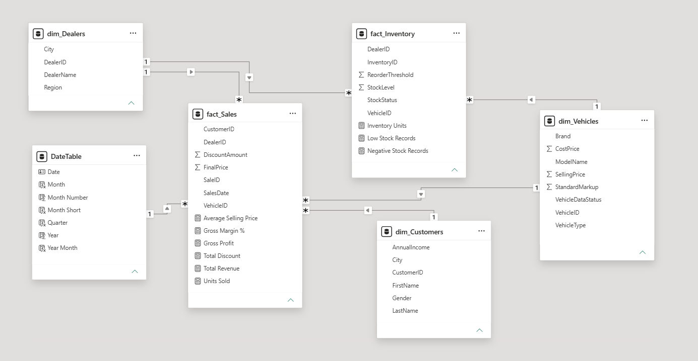
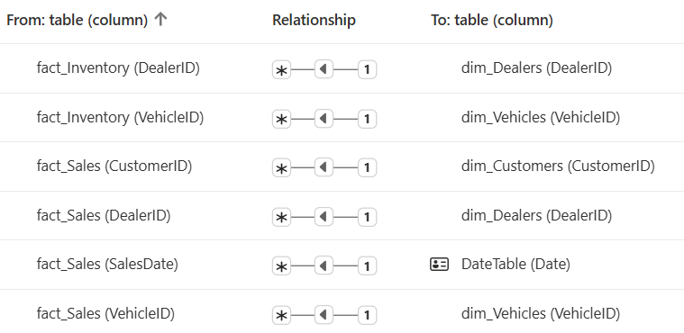
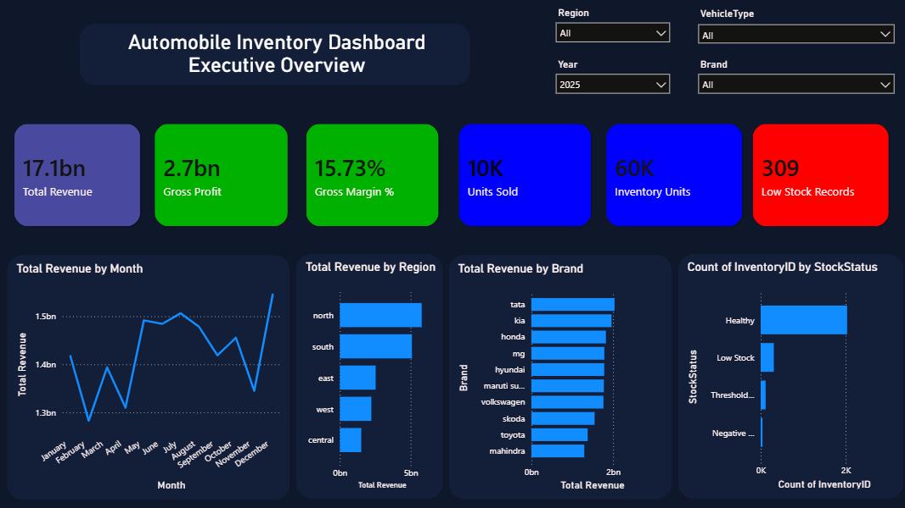
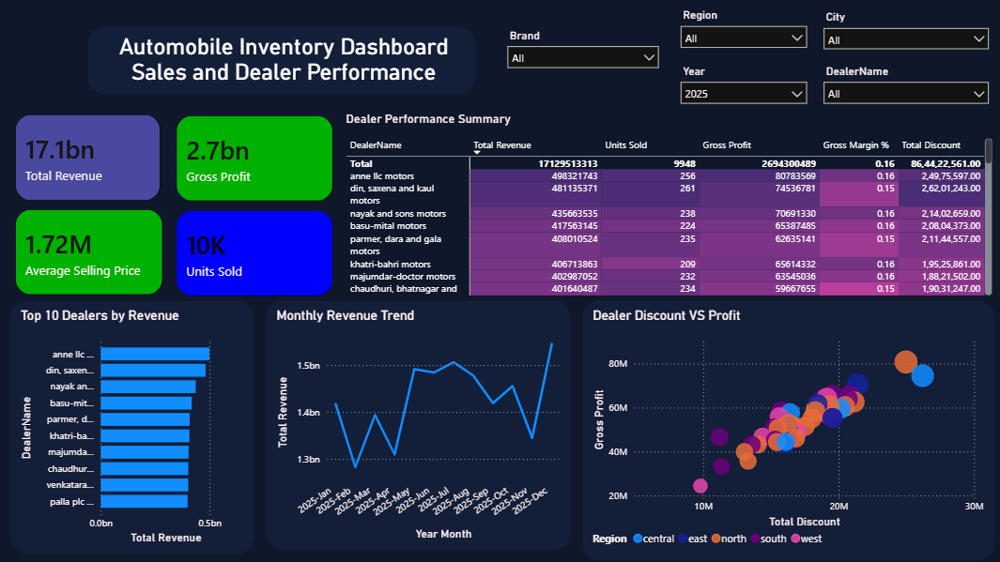
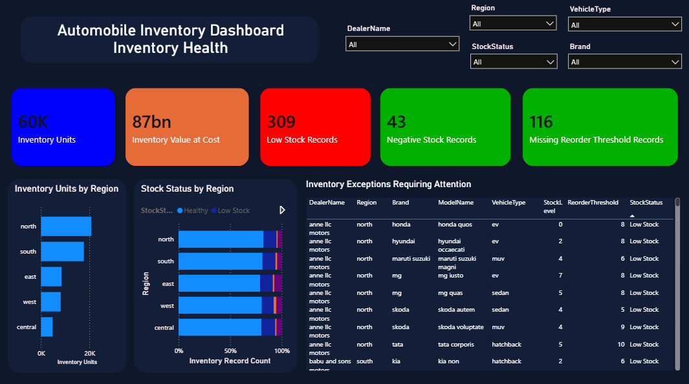

# Automobile Inventory Dashboard

An interactive Power BI dashboard for analyzing automobile sales, dealer performance, profitability, and inventory health.

## Project Overview

This project transforms raw automobile dealership data into a clean, interactive business intelligence report. It helps users monitor revenue, gross profit, dealer performance, vehicle sales, and inventory risks such as low stock, negative stock, and missing reorder thresholds.

The data is synthetic and was generated using Faker for educational and portfolio purposes.

## Tools Used

- Power BI Desktop
- Power Query
- DAX
- CSV files
- Git and GitHub

## Data Preparation

Data cleaning and transformation were completed in Power Query.

Key cleaning actions included:

- Trimmed and cleaned text fields.
- Standardized Customer, Dealer, Vehicle, Sales, and Inventory IDs.
- Removed duplicate CustomerID records while retaining the most complete customer profile.
- Standardized Gender values as Male, Female, Other, and Unknown.
- Replaced missing City and VehicleType values with Unknown.
- Parsed mixed Sales date formats into a single `SaleDate` field.
- Replaced missing DiscountAmount values with zero.
- Retained inventory exceptions instead of deleting them.
- Created inventory status categories: Healthy, Low Stock, Threshold Missing, and Negative Stock.

## Data Model

The report uses a star-schema style model.



```text
DateTable ────────────────> fact_Sales

dim_Customers ───────────> fact_Sales
dim_Dealers ─────────────> fact_Sales
dim_Vehicles ────────────> fact_Sales

dim_Dealers ─────────────> fact_Inventory
dim_Vehicles ────────────> fact_Inventory
```



### Tables

| Table | Description |
|---|---|
| `fact_Sales` | Transaction-level sales data |
| `fact_Inventory` | Dealer-level vehicle inventory records |
| `dim_Customers` | Customer demographic information |
| `dim_Dealers` | Dealer, city, and region information |
| `dim_Vehicles` | Vehicle brand, model, type, and pricing information |
| `DateTable` | Calendar table for time-based analysis |

## Key Measures

The dashboard includes the following DAX measures:

- Total Revenue
- Units Sold
- Total Discount
- Average Selling Price
- Gross Profit
- Gross Margin %
- Inventory Units
- Inventory Value at Cost
- Low Stock Records
- Negative Stock Records
- Missing Reorder Threshold Records

## Dashboard Pages

### 1. Executive Overview

Provides a high-level summary of business performance.

- Total Revenue
- Gross Profit
- Gross Margin %
- Units Sold
- Inventory Units
- Low Stock Records
- Monthly Revenue Trend
- Revenue by Region
- Revenue by Brand
- Inventory Stock Status

### 2. Sales & Dealer Performance

Analyzes dealer contribution to sales and profitability.

- Top 10 Dealers by Revenue
- Monthly Revenue Trend
- Dealer Performance Summary
- Dealer Rank
- Total Discount versus Gross Profit
- Region, city, dealer, and brand filters

### 3. Inventory Health

Highlights inventory availability and operational risks.

- Inventory Units
- Inventory Value at Cost
- Low Stock Records
- Negative Stock Records
- Missing Reorder Threshold Records
- Inventory Units by Region
- Stock Status by Region
- Inventory Exception Detail Table

## Business Questions Answered

- Which regions and dealers generate the highest revenue?
- Which vehicle brands contribute most to sales?
- Which dealers generate strong revenue but weak profit?
- Where are the highest inventory risks?
- Which vehicles require restocking attention?
- How do discounts affect dealer profitability?
- How does revenue change over time?

## Screenshots

### Executive Overview



### Sales & Dealer Performance



### Inventory Health



## Project Structure

```text
Automobile-Inventory-Dashboard/
├── data/
│   ├── raw/
│   │   ├── Customers.csv
│   │   ├── Dealers.csv
│   │   ├── Inventory.csv
│   │   ├── Sales.csv
│   │   └── Vehicles.csv
│   └── cleaned/
│       ├── dim_Customers.xlsx
│       ├── dim_Dealers.xlsx
│       ├── dim_Vehicles.xlsx
│       ├── fact_Inventory.xlsx
│       └── fact_Sales.xlsx
├── documentation/
│   ├── data_model.png
│   └── relationships.png
├── Power BI/
│   └── Automobile-Inventory-Dashboard.pbix
├── screenshots/
│   ├── executive_overview.png
│   ├── inventory_health.png
│   └── sales_and_dealer_performance.png
└── README.md
```

## How to Use

1. Download or clone this repository.
2. Open the `.pbix` file in Power BI Desktop.
3. Update the Power Query source path if required.
4. Refresh the data.
5. Use the report slicers to filter by year, region, dealer, brand, and vehicle type.

## Notes and Limitations

- The dataset is synthetic and should not be interpreted as real dealership performance.
- Price values are displayed as currency units unless a specific currency assumption is defined.
- Inventory is treated as a snapshot because the dataset does not include an inventory-date field.
- Negative stock and missing reorder thresholds are retained as visible data-quality and operational exceptions.

## Author

Himanshu Nepaliya

## License

This project is intended for educational and portfolio use.
